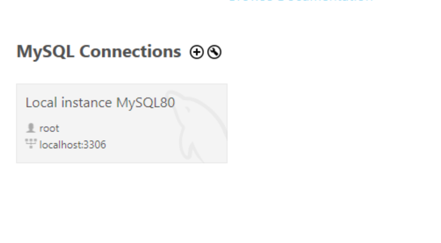

# ETL Project: ETL Pipeline for Weather Data from OpenWeather API to SQL

## Step 1 for creating the ETLPipeline: Setting up the environment
* Create and setup the virtual environment: `python -m venv venv` 
* Create the requirements.txt file to input all the libraries and relevant packages that need to be installed
* Run the file now using the following command `pip install -r requirements.txt`

## Step 2: Create .env file for secrets
* This contains the following information:
  * `API KEY`
  * `DB USER`
  * `DB PASSWORD`
  * `DB HOST`
  * `DB PORT`
  * `DB NAME`

## Step 3: Create the extract file extract.py
* This file will be extracting the data from Openweather
* The API key will be called here. One way to generate a API key for this is by signing up with an account and going to the API section to copy and paste into the .env where it is stored for security as well.
<br>
<br>

```
def fetch_weather(city):
    params = {"q": city, "appid": API_KEY, "units": "metric"}
    response = requests.get(BASE_URL, params=params)
    return response.json() if response.status_code == 200 else None
``` 
* Builds an API call using the city name and your API key. Calls OpenWeather's API. Returns the data as a Python dictionary (converted from JSON). Returns None if something goes wrong.
<br>
<br>
```
def extract_data(cities):
    data = []
    for city in cities:
        print(f"Fetching weather data for: {city}")
        weather = fetch_weather(city)
        if weather:
            data.append(weather)
        else:
            print(f"⚠️ Failed to fetch data for {city}")
    return data
```
* Loops through each city. Uses the fetch_weather(city) function to get current weather data from the OpenWeather API. Collects the successful responses in a list. Prints messages for each city to track progress or show failures. Returns a list of weather data dictionaries—one per successfully fetched city.

## Step 4: Transform the data 'transform.py'
* This file transforms the raw weather data

```
def transform_data(raw_data):
    records = []
    for entry in raw_data:
        record = {
            "city": entry["name"],
            "timestamp": pd.to_datetime(entry["dt"], unit='s'),
            "temperature": entry["main"]["temp"],
            "humidity": entry["main"]["humidity"],
            "pressure": entry["main"]["pressure"],
            "weather": entry["weather"][0]["description"]
        }
        records.append(record)
    df = pd.DataFrame(records)
    return df.drop_duplicates().reset_index(drop=True)
```
* Loops through each city's raw JSON data. Extracts key fields like city name, temperature, humidity, pressure, weather description, and timestamp. Converts each city's data into a clean Python dictionary (called a "record"). Stores all those records in a list and turns it into a Pandas DataFrame. Removes duplicates and resets the row index. Returns a clean, structured table ready to be loaded into the SQL database.

## Step 5: Create a SQL database to store the data into
* Install SQL workbench GUI 
<br>

 Click on this `Local Instance MySQL` <br>
 Select the option for a new query tab in the file dropdown, type the query in to create a new database here and click on the lighting bolt to execute <br>
 This is where the database will come up, now right click on the database and set it as default so it makes the changes straight to this one by default

## Step 6: Loading the data into SQL 'load.py'
* This loads the transformed data into the Database

```
load_dotenv()

def get_engine():
    user = os.getenv("DB_USER")
    password = os.getenv("DB_PASSWORD")
    host = os.getenv("DB_HOST")
    port = os.getenv("DB_PORT")
    db = os.getenv("DB_NAME")
    return create_engine(f"mysql+mysqlconnector://{user}:{password}@{host}:{port}/{db}")

def load_data(df, table_name="weather"):
    engine = get_engine()
    df.to_sql(table_name, con=engine, if_exists='append', index=False)
```
* load_dotenv() : Loads the .env file so the script can securely access sensitive info like database credentials.
* get_engine() : Reads MySQL connection settings from environment variables (DB_USER, DB_PASSWORD, etc.). Builds and returns a SQLAlchemy engine to connect to your MySQL database.
* load_data(df, table_name="weather") : Takes the cleaned DataFrame (df) from the Transform step. Uses the engine to insert the data into a MySQL table (default name: weather). If the table exists, it appends the new data.

## Step 7: Create the ETL file 'etl_pipeline.py'
```
API_KEY = os.getenv("API_KEY")
BASE_URL = "https://api.openweathermap.org/data/2.5/weather"

def fetch_weather(city):
    params = {"q": city, "appid": API_KEY, "units": "metric"}
    response = requests.get(BASE_URL, params=params)
    return response.json() if response.status_code == 200 else None

def extract_data(cities):
    data = []
    for city in cities:
        print(f"Fetching weather data for: {city}")
        weather = fetch_weather(city)
        if weather:
            data.append(weather)
        else:
            print(f"⚠️ Failed to fetch data for {city}")
    return data
```
* API_KEY = os.getenv("API_KEY") : Loads OpenWeather API key from the environment variables (so you don't hardcode secrets).
* fetch_weather(city) : Sends a request to OpenWeather using the given city name. Includes the API key and asks for results in metric units. Returns the weather data as a Python dictionary if the request succeeds, otherwise returns 'None'.
* extract_data(cities): Takes a list of city names (e.g., ["London", "Tokyo"]). Loops through each one and calls fetch_weather(city). Collects all the successful results into a list and returns it. <br><br>
