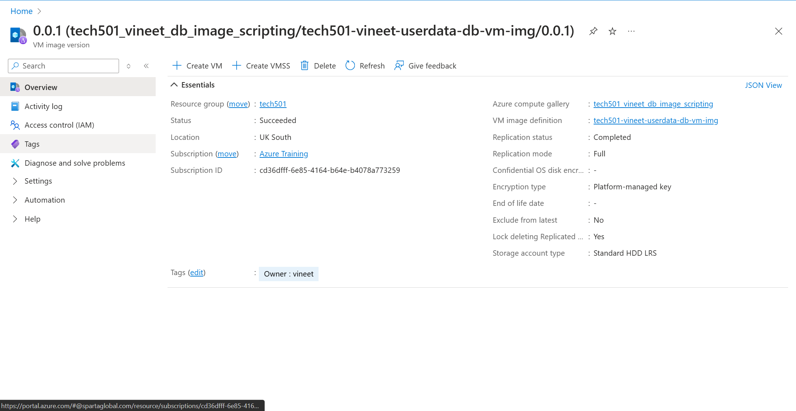
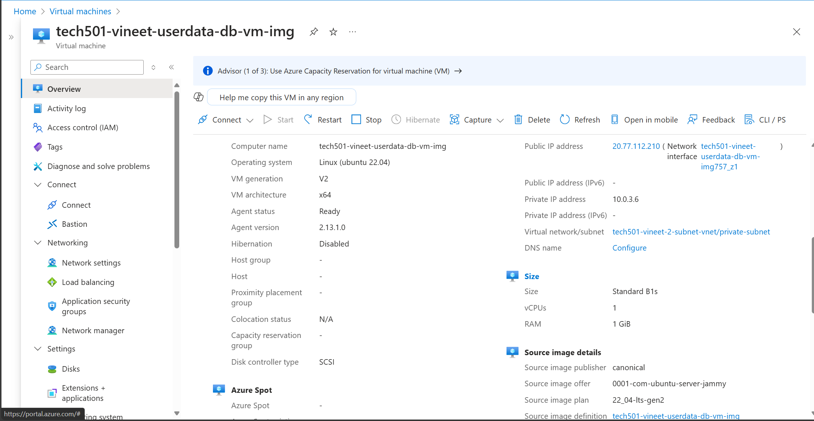
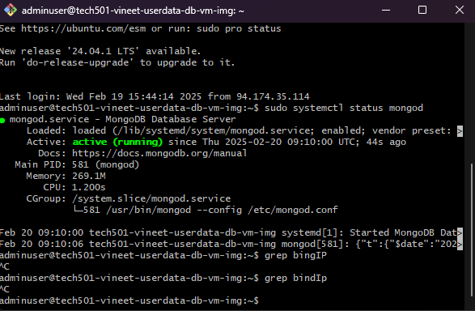
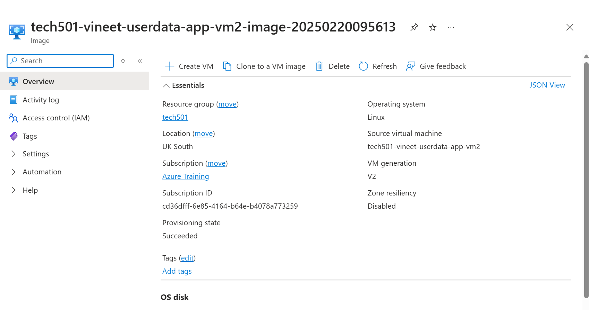
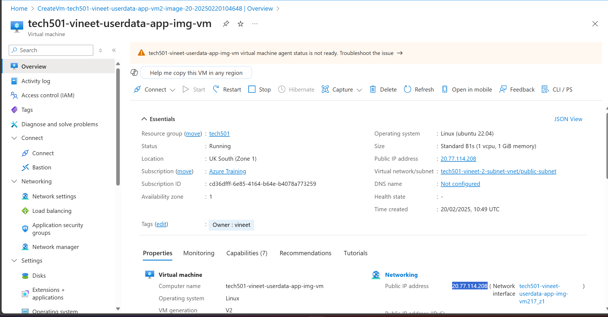
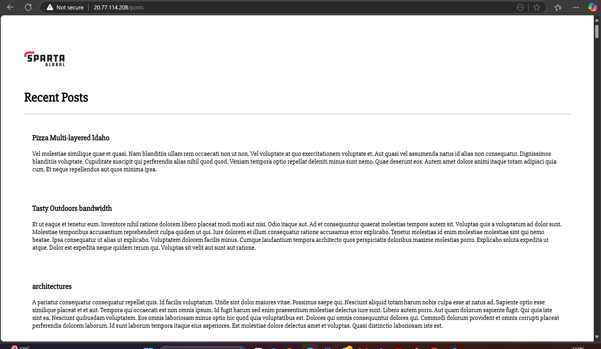

# Use Scripting and User Data for 2-Tier App Deployment

### prov-db.sh
```
#!/bin/bash

# Ensure the script exits on any error
set -e

# Set non-interactive frontend for debconf to avoid prompts
export DEBIAN_FRONTEND=noninteractive

# Update package lists
echo "Updating package lists..."
sudo -E apt-get update -y

# Upgrade packages without interaction
echo "Upgrading packages..."
sudo -E apt-get upgrade -y

# Install dependencies
echo "Installing necessary dependencies..."
sudo -E apt-get install -y gnupg curl

# Download MongoDB GPG key if not already present
if [ ! -f /usr/share/keyrings/mongodb-server-7.0.gpg ]; then
    echo "Adding MongoDB GPG key..."
    curl -fsSL https://www.mongodb.org/static/pgp/server-7.0.asc | sudo gpg -o /usr/share/keyrings/mongodb-server-7.0.gpg --dearmor
else
    echo "MongoDB GPG key already exists. Skipping..."
fi

# Add MongoDB repository if not already added
if ! grep -q "mongodb-org/7.0" /etc/apt/sources.list.d/mongodb-org-7.0.list 2>/dev/null; then
    echo "Adding MongoDB repository..."
    echo "deb [ arch=amd64,arm64 signed-by=/usr/share/keyrings/mongodb-server-7.0.gpg ] https://repo.mongodb.org/apt/ubuntu jammy/mongodb-org/7.0 multiverse" | \
       sudo tee /etc/apt/sources.list.d/mongodb-org-7.0.list > /dev/null
    sudo -E apt-get update -y
else
    echo "MongoDB repository already exists. Skipping..."
fi

# Check if MongoDB is already installed
if ! dpkg -l | grep -q mongodb-org; then
    echo "Installing MongoDB..."
    sudo -E apt-get install -y \
       mongodb-org=7.0.6 \
       mongodb-org-database=7.0.6 \
       mongodb-org-server=7.0.6 \
       mongodb-mongosh \
       mongodb-org-mongos=7.0.6 \
       mongodb-org-tools=7.0.6
else
    echo "MongoDB is already installed. Skipping..."
fi

# Enable and start MongoDB service
echo "Enabling and starting MongoDB service..."
sudo systemctl enable --now mongod

# Configure MongoDB for remote connections (only if needed)
if grep -q "^  bindIp: 127.0.0.1" /etc/mongod.conf; then
    echo "Configuring MongoDB network settings..."
    sudo sed -i '/^  bindIp:/s/127.0.0.1/0.0.0.0/' /etc/mongod.conf
    echo "Restarting MongoDB to apply configuration..."
    sudo systemctl restart mongod
else
    echo "MongoDB network settings already configured. Skipping..."
fi

echo "MongoDB provisioning completed successfully!"
```






### prov-app.sh
```
#!/bin/bash
set -e

# Ensure apt runs in non-interactive mode
export DEBIAN_FRONTEND=noninteractive

echo "Updating package list and upgrading system..."
sudo apt update -y && sudo apt upgrade -y -o Dpkg::Options::="--force-confdef" -o Dpkg::Options::="--force-confold"

# Install Nginx only if not installed
if ! dpkg -l | grep -q nginx; then
    echo "Installing nginx..."
    sudo apt install nginx -y
else
    echo "Nginx is already installed. Skipping..."
fi

echo "Enabling and starting nginx..."
sudo systemctl enable --now nginx

# Install Node.js and npm only if not installed
if ! command -v node &>/dev/null; then
    echo "Installing Node.js and npm..."
    curl -fsSL https://deb.nodesource.com/setup_20.x | sudo bash -
    sudo apt install -y nodejs
else
    echo "Node.js is already installed. Skipping..."
fi

# Install PM2 only if not installed
if ! command -v pm2 &>/dev/null; then
    echo "Installing PM2 globally..."
    sudo npm install -g pm2
else
    echo "PM2 is already installed. Skipping..."
fi

# Clone the app repository if it doesn't already exist
APP_DIR="$HOME/tech501-sparta-app"
if [ ! -d "$APP_DIR" ]; then
    echo "Cloning the Node.js app repository..."
    git clone https://github.com/sameem97/tech501-sparta-app.git "$APP_DIR"
else
    echo "Repository already cloned. Skipping..."
fi

# Configure Nginx reverse proxy only if not already set
NGINX_CONF="/etc/nginx/sites-available/default"
if ! grep -q "proxy_pass http://127.0.0.1:3000" "$NGINX_CONF"; then
    echo "Configuring Nginx reverse proxy..."
    sudo tee "$NGINX_CONF" > /dev/null <<EOL
server {
    listen 80;
    server_name _;

    location / {
        proxy_pass http://127.0.0.1:3000;
        proxy_set_header Host \$host;
        proxy_set_header X-Real-IP \$remote_addr;
        proxy_set_header X-Forwarded-For \$proxy_add_x_forwarded_for;
    }
}
EOL
    echo "Restarting Nginx..."
    sudo systemctl reload nginx
else
    echo "Nginx reverse proxy is already configured. Skipping..."
fi

echo "Setting up MongoDB connection..."
export DB_HOST="mongodb://10.0.3.4:27017/posts"  # Change to actual MongoDB private IP

echo "Navigating to app directory..."
cd "$APP_DIR/app"

echo "Installing npm dependencies..."
npm install

echo "Starting the Node.js app using PM2..."
# Check if the app is already running before starting it again
if ! pm2 list | grep -q "sparta-app"; then
    pm2 start app.js --name sparta-app --update-env -- "$DB_HOST"
else
    echo "PM2 app is already running. Restarting..."
    pm2 restart sparta-app
fi

echo "Enabling PM2 to start on boot..."
pm2 save
sudo env PATH=$PATH:/usr/bin /usr/lib/node_modules/pm2/bin/pm2 startup systemd -u "$USER" --hp "$HOME"
sudo systemctl enable "pm2-$USER"

echo "Deployment successful!"
```




### run-app-only.sh
```
#!/bin/bash
set -e  # Exit on any error

echo "Fetching MongoDB VM Private IP..."
DB_IP="10.0.3.6"  # Change this to the actual private IP of the MongoDB VM

echo "export DB_HOST=mongodb://$DB_IP:27017/posts" | sudo tee /etc/profile.d/db_host.sh
source /etc/profile.d/db_host.sh

echo "Ensuring PM2 and Node.js app are running..."
pm2 resurrect || pm2 start ~/tech501-sparta-app/app/app.js --name sparta-app --update-env -- "$DB_HOST"
pm2 save
sudo systemctl enable "pm2-$(whoami)"
```






