- [Use Ansible for 2 tier app deployment](#use-ansible-for-2-tier-app-deployment)
  - [Task: Research Ansible](#task-research-ansible)
    - [What is Infrastructure as Code (IaC)?](#what-is-infrastructure-as-code-iac)
    - [Benefits of IaC](#benefits-of-iac)
    - [When/where to use IaC](#whenwhere-to-use-iac)
    - [What are the tools available for IaC?](#what-are-the-tools-available-for-iac)
    - [What is configuration management (CM)?](#what-is-configuration-management-cm)
    - [What is provisioning of infrastructure? Do CM tools do it?](#what-is-provisioning-of-infrastructure-do-cm-tools-do-it)
    - [What is Ansible and how does it work?](#what-is-ansible-and-how-does-it-work)
    - [Who is using IaC and Ansible in the industry](#who-is-using-iac-and-ansible-in-the-industry)
  - [Task: Draw diagram of the Ansible architecture to be used](#task-draw-diagram-of-the-ansible-architecture-to-be-used)
  - [Task: Create EC2 instances for Ansible controller and first target node](#task-create-ec2-instances-for-ansible-controller-and-first-target-node)
  - [Task: Setup dependencies for the Ansible controller and first target node](#task-setup-dependencies-for-the-ansible-controller-and-first-target-node)
    - [Step 1: SSH into the controller and install Ansible](#step-1-ssh-into-the-controller-and-install-ansible)
    - [Step 2: Check ansible folder](#step-2-check-ansible-folder)
    - [Step 3: Scp key to the controller](#step-3-scp-key-to-the-controller)
    - [Step 4: SSH into the node vm](#step-4-ssh-into-the-node-vm)
    - [Step 5: Setup permissions](#step-5-setup-permissions)
    - [Step 6: SSH into controller vm and ping](#step-6-ssh-into-controller-vm-and-ping)
    - [Step 7: Open the host file and specify the ip address of node app vm and location of ssh key](#step-7-open-the-host-file-and-specify-the-ip-address-of-node-app-vm-and-location-of-ssh-key)
    - [Step 8: Run ping again and should get a pong and success result](#step-8-run-ping-again-and-should-get-a-pong-and-success-result)
  - [Task: Use other ad hoc command](#task-use-other-ad-hoc-command)
    - [Research: Ansible ad hoc commands](#research-ansible-ad-hoc-commands)
      - [What are they?](#what-are-they)
      - [Why is using the ‘ping’ module an ad hoc command?](#why-is-using-the-ping-module-an-ad-hoc-command)
      - [If you don’t specify a module to be used, is no module used?](#if-you-dont-specify-a-module-to-be-used-is-no-module-used)
      - [What are the advantages and disadvantages of using the ‘command’ module?](#what-are-the-advantages-and-disadvantages-of-using-the-command-module)
    - [Ad hoc commands for target node](#ad-hoc-commands-for-target-node)
  - [Task: Do update and upgrade on target nodes using ad hoc commands](#task-do-update-and-upgrade-on-target-nodes-using-ad-hoc-commands)
  - [Task: Create and run playbook to install nginx on target node](#task-create-and-run-playbook-to-install-nginx-on-target-node)
    - [Step 1: Create a new playbook in the ansible folder](#step-1-create-a-new-playbook-in-the-ansible-folder)
    - [Step 2: Name it install\_nginx.yml](#step-2-name-it-install_nginxyml)
    - [Step 3: Run the yml file](#step-3-run-the-yml-file)
  - [Task: Create and run playbook to provision app VM](#task-create-and-run-playbook-to-provision-app-vm)
    - [Step 1: Create a new yml file](#step-1-create-a-new-yml-file)
    - [Step 2: Go into the file and create the playbook](#step-2-go-into-the-file-and-create-the-playbook)
    - [Step 3: Launch the playbook](#step-3-launch-the-playbook)
    - [Step 4: Go and check the to see if the app has launched](#step-4-go-and-check-the-to-see-if-the-app-has-launched)
    - [Step 5: Create a new yml file](#step-5-create-a-new-yml-file)
    - [Step 6:](#step-6)
  - [Task: Create the database VM (another Ansible target node)](#task-create-the-database-vm-another-ansible-target-node)
  - [Task: Create and run playbook to install Mongo DB](#task-create-and-run-playbook-to-install-mongo-db)
  - [Task: Create and run playbooks to provision the app and database](#task-create-and-run-playbooks-to-provision-the-app-and-database)
    - [Step 1: Create a new playbook named prov-db.yml](#step-1-create-a-new-playbook-named-prov-dbyml)
    - [Step 2: Check Mongodb status and bind ip is configured](#step-2-check-mongodb-status-and-bind-ip-is-configured)
    - [Step 3: Create a DB\_HOST environment varaible in the app vm](#step-3-create-a-db_host-environment-varaible-in-the-app-vm)
    - [Step 4: Create an environment variable in the app playbook](#step-4-create-an-environment-variable-in-the-app-playbook)
    - [Step 5: Test the posts page is working](#step-5-test-the-posts-page-is-working)
    - [Step 6: Make one playbook with all app and db elements](#step-6-make-one-playbook-with-all-app-and-db-elements)


# Use Ansible for 2 tier app deployment


## Task: Research Ansible
### What is Infrastructure as Code (IaC)?

Infrastructure as Code (IaC) is the process of managing and provisioning computing infrastructure through machine-readable definition files, rather than physical hardware configuration or interactive configuration tools.

### Benefits of IaC

- **Consistency**: Ensures the same configuration is applied every time.
- **Speed**: Automates the provisioning process, reducing setup time.
- **Scalability**: Easily replicate environments for scaling.
- **Documentation**: Configuration files serve as documentation.
- **Version Control**: Track changes and collaborate using version control systems.

### When/where to use IaC

IaC is used in environments where infrastructure needs to be provisioned, managed, and scaled efficiently. It is particularly useful in cloud computing, continuous integration/continuous deployment (CI/CD) pipelines, and large-scale data centers.

### What are the tools available for IaC?

- **Terraform**
- **Ansible**
- **Puppet**
- **Chef**
- **CloudFormation**

### What is configuration management (CM)?

Configuration Management (CM) is the process of maintaining computer systems, servers, and software in a desired, consistent state. It involves automating the deployment and configuration of systems.

### What is provisioning of infrastructure? Do CM tools do it?

Provisioning of infrastructure involves setting up the necessary hardware, software, and network resources to support applications. Some CM tools, like Ansible and Terraform, can also handle provisioning tasks.

### What is Ansible and how does it work?

Ansible is an open-source automation tool used for configuration management, application deployment, and task automation. It works by connecting to nodes and pushing out small programs, called "Ansible modules," to perform tasks.

### Who is using IaC and Ansible in the industry

Many organizations across various industries use IaC and Ansible, including:

- **Tech companies**: Google, Facebook, Netflix
- **Financial institutions**: JPMorgan Chase, Goldman Sachs
- **Healthcare**: Kaiser Permanente, Mayo Clinic
- **Retail**: Walmart, Target

## Task: Draw diagram of the Ansible architecture to be used
              +--------------------+
              |  Ansible Controller |
              |  (Has Ansible)      |
              +--------------------+
                       |
          ------------------------
          |                      |
+----------------+       +----------------+
|  App VM       |       |  Database VM   |
| (No Ansible)  |       | (No Ansible)   |
+----------------+       +----------------+

## Task: Create EC2 instances for Ansible controller and first target node
1. Create 2 instances on AWS:

1. Ansible 'controller' instance:

1. Name: techxxx-yourname-ubuntu-2204-ansible-controller

2. Size: t3.micro as usual

3. Security group: Allow SSH port

4. Key pair: Use the one you usually use for your AWS instances

5. Image: Ubuntu Server 22.04 LTS (free tier eligible)

6. User data: Leave it blank - don't run any scripts or user data on it

2. Ansible 'target node' instance (will run the app)

1. Name: techxxx-yourname-ubuntu-2204-ansible-target-node-app

2. Size: t3.micro as usual

3. Security group: Allow SSH, HTTP, port 3000 (the usual for the app)

4. Key pair: Use the one you usually use for your AWS instances (and the same one as you used on the controller)

5. Image: Ubuntu Server 22.04 LTS (free tier eligible)

6. User data: Leave it blank - don't run any scripts or user data on it

2. Check you can SSH into both machines

## Task: Setup dependencies for the Ansible controller and first target node
### Step 1: SSH into the controller and install Ansible
* Run the update and upgrade first
* `sudo apt install -y ansible` - to install ansible
### Step 2: Check ansible folder
### Step 3: Scp key to the controller
* `scp -i $SSH_KEY $SSH_KEY $CONTROLLER:~/.ssh/id_rsa"`
### Step 4: SSH into the node vm
### Step 5: Setup permissions
* chmod 600 ~/.ssh/id_rsa
* chmod 700 ~/.ssh
### Step 6: SSH into controller vm and ping
* `ansible all -m ping` - Used to ping, and should receive a response of `pong`
### Step 7: Open the host file and specify the ip address of node app vm and location of ssh key
### Step 8: Run ping again and should get a pong and success result

## Task: Use other ad hoc command
### Research: Ansible ad hoc commands

#### What are they?
Ansible ad hoc commands are simple, one-line commands used to perform quick tasks on remote nodes without writing a playbook. They are useful for tasks like checking connectivity, managing files, and restarting services.
#### Why is using the ‘ping’ module an ad hoc command?
Using the `ping` module with Ansible is considered an ad hoc command because it is a one-time command executed directly from the command line to check the connectivity of managed nodes.
#### If you don’t specify a module to be used, is no module used?
If you don't specify a module in an ad hoc command, Ansible defaults to using the `command` module, which runs commands on the remote nodes.
#### What are the advantages and disadvantages of using the ‘command’ module?
**Advantages:**
- Simple and straightforward to use.
- Does not require any additional dependencies on the managed nodes.
**Disadvantages:**
- Limited functionality compared to other modules.
- Does not support advanced features like idempotency (ensuring the same result regardless of how many times the command is run).

### Ad hoc commands for target node
* `ansible web -m shell -a "cat /etc/os-release" -i /etc/ansible/hosts`
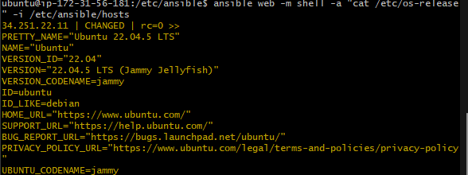
* `ansible web -m shell -a "date" -i /etc/ansible/hosts`
  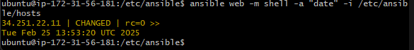

## Task: Do update and upgrade on target nodes using ad hoc commands
1. command module: `ansible web -m apt -a "update_cache=yes upgrade=dist" -i /etc/ansible/hosts --become`
2. Shell module: Created a script file and put the script for update and upgrade, run the script to do the update and upgrade
3. Ansible playbook method: create a playbook using yml and input that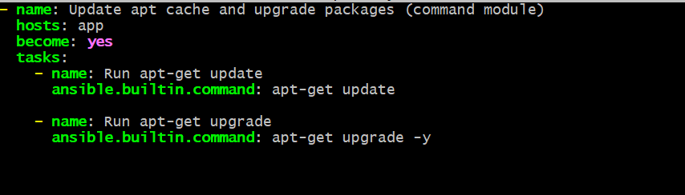 

## Task: Create and run playbook to install nginx on target node
### Step 1: Create a new playbook in the ansible folder
### Step 2: Name it install_nginx.yml
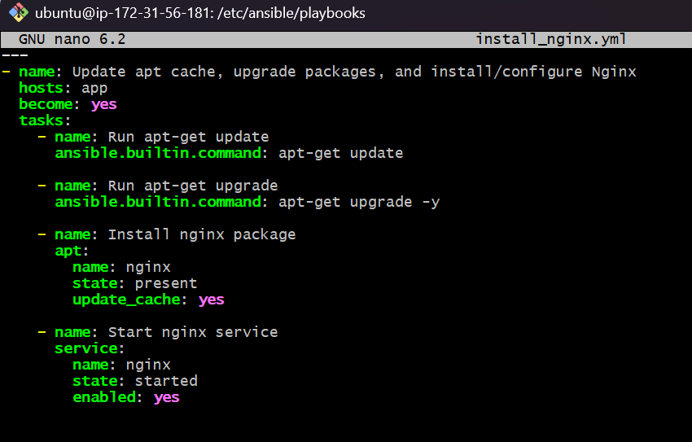
### Step 3: Run the yml file
* `/etc/ansible$ ansible-playbook -i hosts playbooks/install_nginx.yml` - To run the yml file
  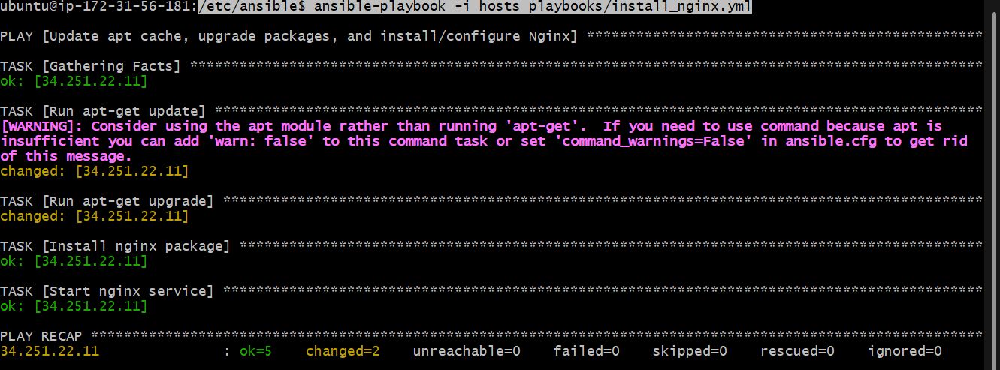

## Task: Create and run playbook to provision app VM
### Step 1: Create a new yml file
* Create a new file yml file named: prov_app_with_npm_start.yml
### Step 2: Go into the file and create the playbook
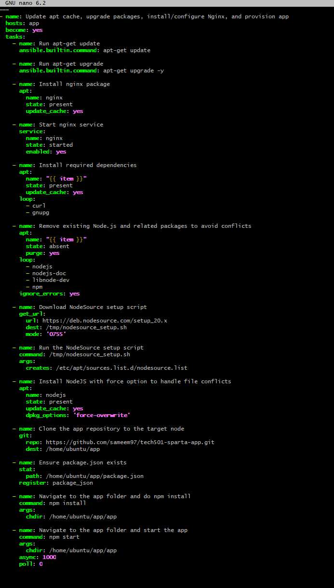
### Step 3: Launch the playbook
* `ansible-playbook -i hosts playbooks/prov_app_with_npm_start.yml`
### Step 4: Go and check the to see if the app has launched

### Step 5: Create a new yml file 
* Name it prov_app_with_pm2.yml
### Step 6:
* Make the app run in the background (pm2)
* The added section for the playbook
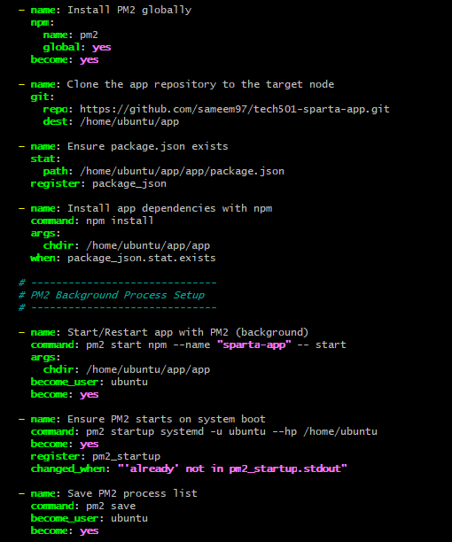

## Task: Create the database VM (another Ansible target node)
* Had public key denied when trying to do ping
* Copied the public key from local, opened the authorised_keys and pasted it in
* Also in the hosts file specifying the correct name of the private key

## Task: Create and run playbook to install Mongo DB
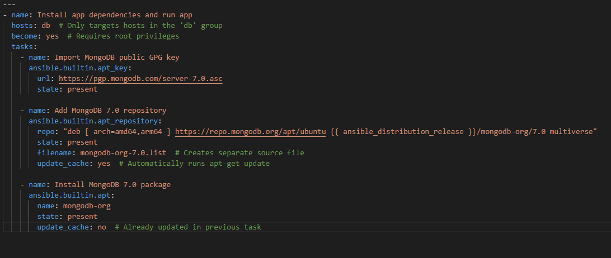
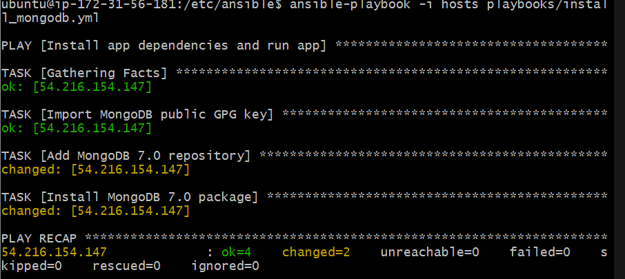

## Task: Create and run playbooks to provision the app and database
### Step 1: Create a new playbook named prov-db.yml
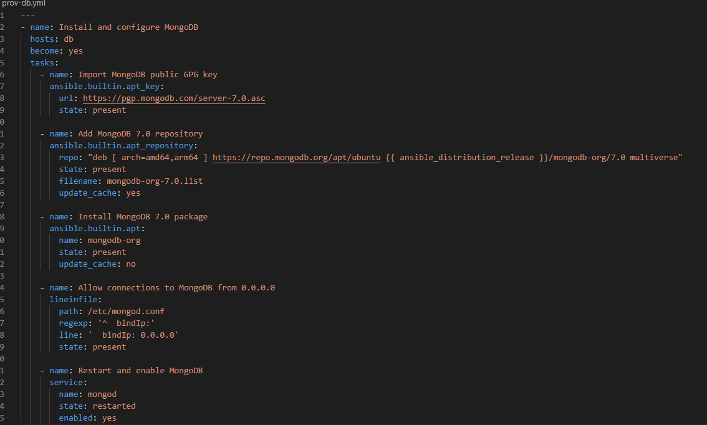
### Step 2: Check Mongodb status and bind ip is configured
* check status of mongodb- `ansible db -m shell -a "systemctl status mongod" -i hosts`
* check the bind ip is correct- `ansible db -m shell -a "grep bindIp /etc/mongod.conf" -i hosts`
### Step 3: Create a DB_HOST environment varaible in the app vm
### Step 4: Create an environment variable in the app playbook
### Step 5: Test the posts page is working
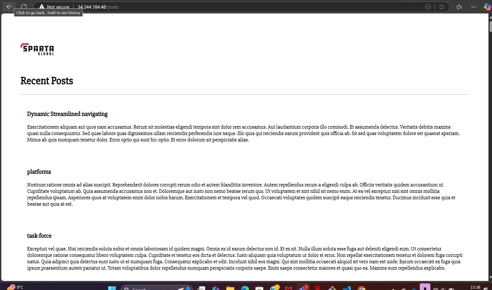
### Step 6: Make one playbook with all app and db elements
```bash
---
- name: Provision Database Server (MongoDB)
  hosts: db
  become: yes
  tasks:
    - name: Update and upgrade all packages
      ansible.builtin.apt:
        update_cache: yes
        upgrade: yes

    - name: Import MongoDB public GPG key
      ansible.builtin.apt_key:
        url: https://pgp.mongodb.com/server-7.0.asc
        state: present

    - name: Add MongoDB 7.0 repository
      ansible.builtin.apt_repository:
        repo: "deb [ arch=amd64,arm64 ] https://repo.mongodb.org/apt/ubuntu {{ ansible_distribution_release }}/mongodb-org/7.0 multiverse"
        state: present
        filename: mongodb-org-7.0.list
        update_cache: yes

    - name: Install MongoDB 7.0 package
      ansible.builtin.apt:
        name: mongodb-org
        state: present
        update_cache: no

    - name: Allow connections to MongoDB from any IP
      ansible.builtin.lineinfile:
        path: /etc/mongod.conf
        regexp: '^  bindIp:'
        line: '  bindIp: 0.0.0.0'
        state: present

    - name: Restart and enable MongoDB service
      ansible.builtin.service:
        name: mongod
        state: restarted
        enabled: yes

- name: Provision Application Server (Node.js, PM2, Nginx)
  hosts: app
  become: yes
  vars:
    db_host: "mongodb://172.31.57.57:27017/posts"

  tasks:
    - name: Update and upgrade all packages
      ansible.builtin.apt:
        update_cache: yes
        upgrade: yes

    - name: Install required dependencies
      ansible.builtin.apt:
        name:
          - nginx
          - curl
          - gnupg
        state: present
        update_cache: yes

    - name: Configure Nginx as reverse proxy
      ansible.builtin.copy:
        dest: /etc/nginx/sites-available/default
        content: |
          server {
            listen 80 default_server;
            listen [::]:80 default_server;

            root /var/www/html;
            index index.html index.htm index.nginx-debian.html;
            server_name _;

            location / {
                proxy_pass http://localhost:3000;
                proxy_http_version 1.1;
                proxy_set_header Upgrade $http_upgrade;
                proxy_set_header Connection 'upgrade';
                proxy_set_header Host $host;
                proxy_cache_bypass $http_upgrade;
            }
          }
      notify: Restart Nginx

    - name: Enable Nginx site configuration
      ansible.builtin.file:
        src: /etc/nginx/sites-available/default
        dest: /etc/nginx/sites-enabled/default
        state: link
        force: yes

    - name: Start and enable Nginx service
      ansible.builtin.service:
        name: nginx
        state: started
        enabled: yes

    - name: Remove existing Node.js and related packages to avoid conflicts
      ansible.builtin.apt:
        name:
          - nodejs
          - nodejs-doc
          - libnode-dev
          - npm
        state: absent
        purge: yes
      ignore_errors: yes

    - name: Install Node.js 20.x
      block:
        - name: Download NodeSource setup script
          ansible.builtin.get_url:
            url: https://deb.nodesource.com/setup_20.x
            dest: /tmp/nodesource_setup.sh
            mode: '0755'

        - name: Run the NodeSource setup script
          ansible.builtin.command: /tmp/nodesource_setup.sh
          args:
            creates: /etc/apt/sources.list.d/nodesource.list

        - name: Install Node.js
          ansible.builtin.apt:
            name: nodejs
            state: present
            update_cache: yes

    - name: Install PM2 globally
      community.general.npm:
        name: pm2
        global: yes

    - name: Clone the app repository
      ansible.builtin.git:
        repo: https://github.com/sameem97/tech501-sparta-app.git
        dest: /home/ubuntu/app

    - name: Ensure package.json exists
      ansible.builtin.stat:
        path: /home/ubuntu/app/app/package.json
      register: package_json

    - name: Install app dependencies with npm
      ansible.builtin.command: npm install
      args:
        chdir: /home/ubuntu/app/app
      when: package_json.stat.exists

    - name: Set environmental variable DB_HOST
      ansible.builtin.lineinfile:
        path: /etc/environment
        regexp: "^DB_HOST="
        line: 'DB_HOST="{{ db_host }}"'
        state: present

    - name: Export DB_HOST in current shell
      ansible.builtin.shell: export DB_HOST="{{ db_host }}"
      changed_when: false

    - name: Start/Restart app with PM2
      ansible.builtin.command: pm2 start npm --name "sparta-app" -- start
      args:
        chdir: /home/ubuntu/app/app
      become_user: ubuntu
      become: yes

    - name: Ensure PM2 starts on system boot
      ansible.builtin.command: pm2 startup systemd -u ubuntu --hp /home/ubuntu
      become: yes
      register: pm2_startup
      changed_when: "'already' not in pm2_startup.stdout"

    - name: Save PM2 process list
      ansible.builtin.command: pm2 save
      become_user: ubuntu
      become: yes

  handlers:
    - name: Restart Nginx
      ansible.builtin.service:
        name: nginx
        state: restarted
```
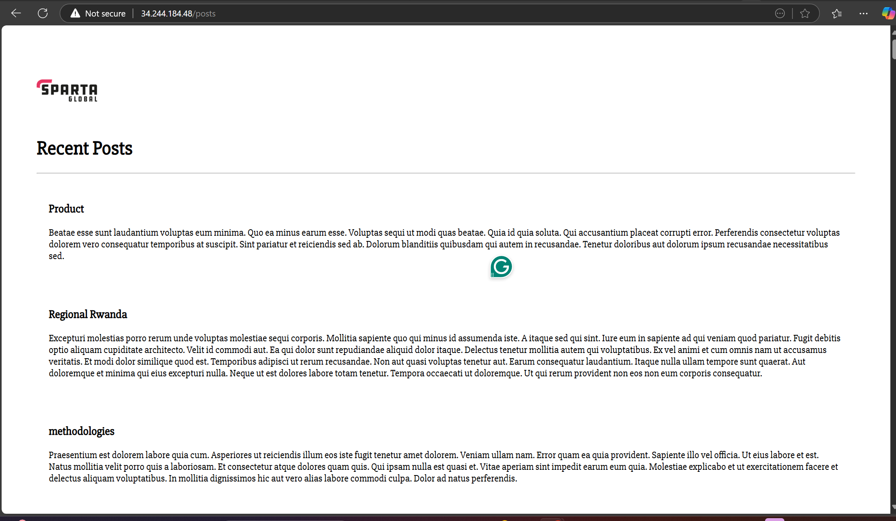