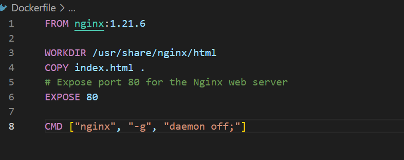
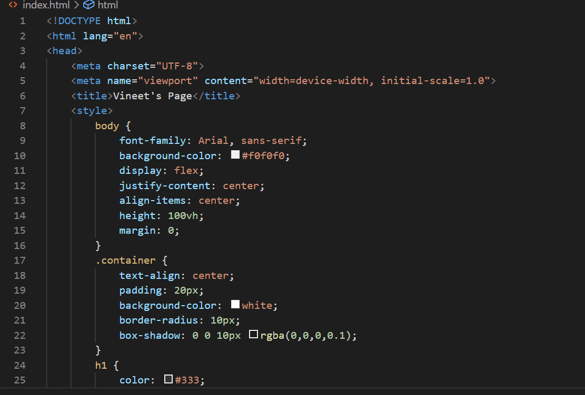
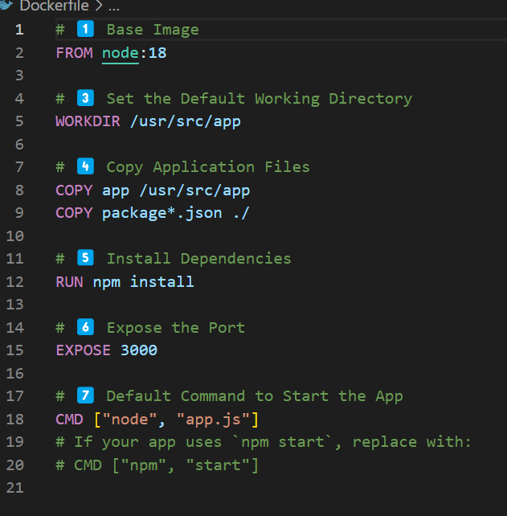
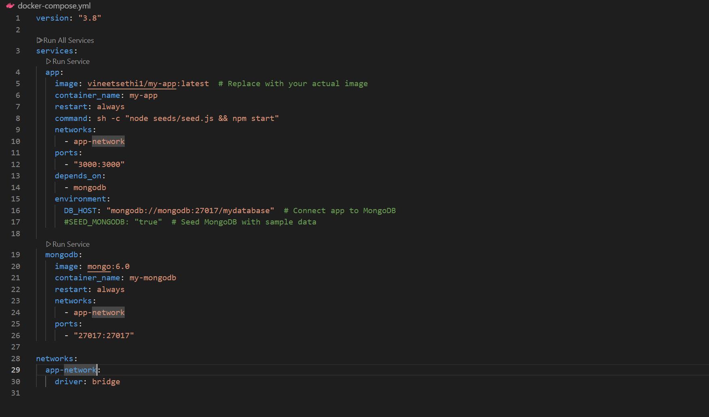
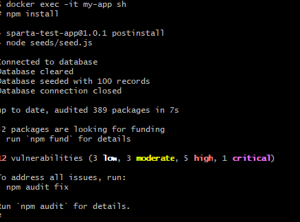
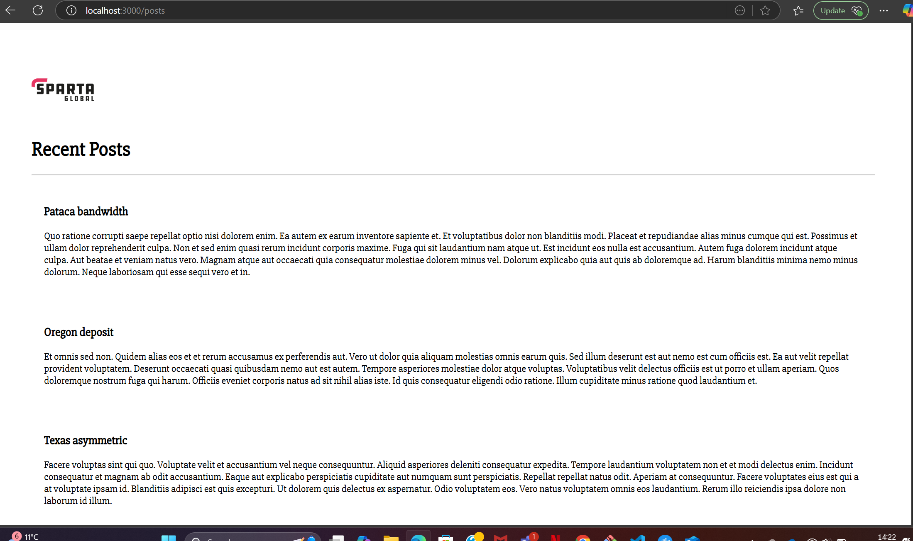
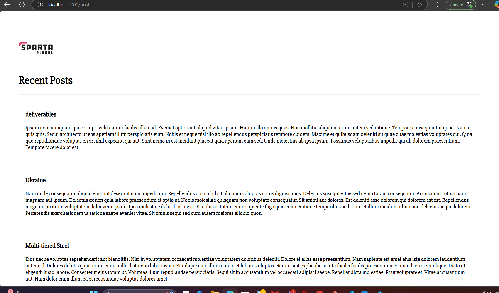

# Docker
## Differences between virtualisation and containerisation
| Feature          | Virtualization 🖥️       | Containerization 📦     |
|-----------------|----------------------|----------------------|
| Definition      | Runs multiple OSes on a hypervisor. | Runs lightweight apps using shared OS. |
| Isolation      | Each VM has its own OS. | Containers share the host OS. |
| Resource Usage  | High (each VM includes a full OS). | Low (containers share the OS kernel). |
| Performance    | Slower (full OS overhead). | Faster (directly runs on the host OS). |
| Startup Time   | Minutes (loads entire OS). | Seconds (only starts the app). |
| Portability    | Limited (large VM images). | Highly portable (runs anywhere). |
| Use Case       | Running multiple OS environments. | Microservices, cloud apps, CI/CD. |
| Tools         | VMware, VirtualBox, Hyper-V. | Docker, Kubernetes, Podman. |

### What's Included in a Container vs. Virtual Machine?
| Component       | Container 📦              | Virtual Machine 🖥️          |
|----------------|-------------------------|-------------------------|
| Kernel         | Shared with the host OS  | Separate for each VM    |
| Operating System | Not included (uses host OS) | Full OS (Windows, Linux, etc.) |
| Libraries & Dependencies | Included for the app only | Included with the full OS |
| Application    | Runs inside the container | Runs inside the VM |
| Hypervisor     | ❌ Not needed              | ✅ Required to manage VMs |

### Benefits of Each (Virtual Machines vs. Containers)
🖥️ Virtual Machines (VMs) Benefits 
✅ Full Isolation:

Each VM has its own OS, providing strong security.
Ideal for running different OSes on one machine (e.g., Windows and Linux). 
✅ Better for Legacy Apps:

Great for apps that require a specific OS or system dependencies. 
✅ Stable & Reliable:

Works well in traditional enterprise environments. 
✅ Supports GUI-based Applications:

Unlike containers, VMs can run full desktop environments. 
📦 Container Benefits 
✅ Lightweight & Fast:

Starts in seconds (no OS boot required). 
Uses fewer resources since multiple containers share the same OS. 
✅ Highly Portable:

"Build once, run anywhere" (works the same across different environments). 
✅ Better for Microservices & Cloud:

Works well for DevOps, CI/CD, and modern cloud applications. 
✅ Scalability & Efficiency: 
Uses less memory and CPU compared to VMs, allowing more apps per server.

## Microservices
### What are they?
Microservices are a software architecture style where an application is broken down into small, independent services that communicate with each other. Each microservice: 
✔️ Handles a specific function (e.g., authentication, payment, inventory). 
✔️ Communicates via APIs (usually REST or gRPC). 
✔️ Can be developed, deployed, and scaled independently. 

### How Are Microservices Made Possible?
1. Containers & Orchestration
   * Docker: Packages microservices into isolated, portable containers.
   * Kubernetes: Manages, scales, and orchestrates microservices across multiple servers.
2. API Communication
   * RESTful APIs or gRPC: Allows microservices to talk to each other.
   * Message Brokers (Kafka, RabbitMQ): Helps in asynchronous communication.
3. DevOps & CI/CD
   * Continuous Integration/Continuous Deployment (CI/CD): Automates testing and deployment.
   * Infrastructure as Code (IaC) (Terraform, Ansible): Automates cloud/server provisioning.
4. Cloud & Scalability
   * Cloud Services (AWS, Azure, GCP): Provides managed services to deploy microservices.
   * Service Discovery (Eureka, Consul): Helps services locate each other dynamically.

## Docker- What is it
### What is it?
Docker is a containerization platform that allows developers to package applications and their dependencies into lightweight, portable containers. These containers can run on any environment (local, cloud, or on-premise) without compatibility issues.

🔹 Key Features: 
✅ Portability – "Write once, run anywhere" 
✅ Lightweight – Uses fewer resources than virtual machines 
✅ Fast Deployment – Containers start in seconds 
✅ Scalability – Easily scale applications across multiple servers 

### Alternatives
* Podman
* LXC (Linux Containers)
* Singularity 

### Success story: Netflix
Netflix needed to:

Scale services rapidly across different cloud environments. 
Improve developer productivity. 
Reduce deployment time for thousands of microservices. 
🔹 The Docker Solution: 
✅ Microservices with Docker: Netflix broke down its monolithic app into microservices, each running in Docker containers. 
✅ Consistent Environment: Developers could create identical local environments to production using Docker. 
✅ Scalability with Kubernetes: Containers were managed and scaled dynamically. 

## Task: Run and pull your first image
* Command to see docker images already on your local machine: `docker image ls`
* Run command 'hello world' is: `docker run hello-world`
* First run: Docker checks if the image exists on your local machine. 
  Since the image is missing, Docker pulls it from Docker Hub.
* Second run: Docker checks if the hello-world image is already on your machine. Since it's already downloaded, Docker does not pull it again.

## Task: Run Nginx web server in a Docker container
`docker pull nginx:latest`
`docker run -d -p 80:80 --name my-nginx nginx` - Creates the nginx and specifying the port for it to run on
`docker start my-nginx`- to start nginx
`docker ps` - to check if its running `docker ps -a`- to see all the containers
`http://localhost` - to check if its working
`docker stop my-nginx` - to stop the container running

## Task: Remove a container
* `docker rm my-nginx` - To remove the nginx container. Doing whilst running will give you an error of: `Error response from daemon: cannot remove container "/my-nginx": container is running: stop the container before removing or force remove`
* `docker exec -it <container_name_or_id> /bin/bash`- the command to access the shell of a container, for my nginx it would be `docker exec -it my-nginx /bin/bash` - used windows powershell as it didn't work in git bash
* `apt-get update
apt-get install sudo` - used to install sudo so we can run the update and upgrade commands
* `cd /usr/share/nginx/html` - command to get to the part where the index file is for the nginx.
* `apt-get update
apt-get install nano` - To install nano command.
`nano index.html` - to go into the index file to make the change

## Task: Run a differetn container on a different port
* Using the command: `docker run -d -p 80:80 --name dreamteam-nginx daraymonsta/nginx-257:dreamteam` - gives an error can't expose it to port 80 as it is already in use.
* `docker rm dreamteam-nginx`- to remove the container]
* `docker run -d -p 90:80 --name dreamteam-nginx daraymonsta/nginx-257:dreamteam` - command to put it on port 90, use http://localhost:90 to see it on port 90
* 

## Task: Push host-custom-static-webpage container image to Docker Hub
### Step 1: Get the container id 
* Get the container id first by running the command `docker ps`
### Step 2: Commit the file
* Using this command `docker commit <container_id> yourdockerhubusername/custom-nginx`
### Step 3: Login your docker account in the terminal
* `docker login`- will tell you match the authorisation code from the terminal to the one in the browser
### Step 4: Push the image to your docker account
* `docker push myusername/custom-nginx:latest` -pushes it to your docker account
### Docker command that runs the container which uses the pushed container image
* docker run -d -p 80:80 --name my-nginx-container yourdockerhubusername/custom-nginx:latest

## Task: Automate docker image creation using a Dockerfile
### step 1 - create docker file

### step 2 - create an index.html file

### Step 3
* `docker build -t tech501-mod-nginx-dockerfile .`       - creates the image
* `docker run -d -p 80:80 --name my-nginx-container2 sha2`      - creates the container

* `docker rmi <image-id>` to remove the image off your local
* `docker run --pull always -d -p 80:80 --name my-nginx-container yourdockerhubusername/nginx-custom:latest`

### Step 4: Run the localhost in the browser

## Task: Run Sparta test app in a docker container
### Step 1: Create a new repo and folder 
### Step 2: Move the app folder into the new folder
### Step 3: Create a new Dockerfile in the folder

### Step 4: Build the docker image
* `docker build -t yourdockerhubusername/my-app:latest .` - this command will build the docker image
### Step 5: Run the docker container
* `docker run -d -p 3000:3000 --name my-running-app yourdockerhubusername/my-app:latest`- this command will run the docker container 

### Step 6: Push the image to docker hub
* Login into docker account
* Use this command to push to docker account `docker push yourdockerhubusername/my-app:latest`
### Step 6: Force docker to pull a fresh image from docker hub
* First force the image to be removed from local
* `docker run --pull always -d -p 3000:3000 --name my-running-app yourdockerhubusername/my-app:latest`

## Task: Research Docker compose
### Why use it?
* Docker Compose is useful when you need to define and manage multi-container Docker applications. Instead of manually running multiple docker run commands, Compose allows you to define your entire application stack in a simple YAML file (docker-compose.yml). Here’s why you should use Docker Compose:
  * Easy Configuration and Version Control
  * Simplifies Multi-Container Management
  * Consistency Across Environments
  * Dependency Management
### How to use it?
### What to install?
* You need to install docker compose
### How to store the compose file?
* A docker-compose.yml file should be stored in your project directory, typically at the root.
### Command to manage your application
* Start the Application (Without Detached Mode) = `docker compose up`
* Start the Application (In Detached Mode) = `docker compose up -d`
* The difference between with/without detached node: Detached (-d) -Runs in the background, keeps running even if you close the terminal. Foreground (default)	Shows logs in the terminal, stops when you press CTRL + C.
* Stop the application: `docker compose down` or if you want to stop without removing the containers: `docker compose stop`
* Run application in detached mode= `docker compose up -d`
* Check Services Running with Docker Compose= `docker compose ps`
* View logs in real time= `docker compose logs -f`
* View docker compose images= `docker compose images`

## Task: Use Docker compose to run app and database containers
### Step 1: Pull the docker MongoDB image
* `docker pull mongo:6.0`
* Run it as a container `docker run -d \
  --name my-mongodb \
  -p 27017:27017 \
  -v mongo-data:/data/db \
  -e MONGO_INITDB_ROOT_USERNAME=admin \
  -e MONGO_INITDB_ROOT_PASSWORD=password \
  mongo:6.0
  `
### Step 2: Create a docker-compose.yml file
* `touch docker-compose.yml`
* `nano docker-compose.yml`

### Step 3: Start the containers
* `docker compose up -d`
### Step 4: SSH into the app container
* `docker exec -it my-app sh`
* Create the DB_HOST env variable
### Step 5: Make sure to keep the app and db in the same network
* This can be done in the docker compose file by specifying network in both the app and db code
### Step 6: You can either manually seed the database or automatically
* Manual:
  * Go into the app cotainer and run `npm install`
* 
* 

* Automatic:
   * Go into the compose file and a command `command: sh -c "node seeds/seed.js && npm start"`
