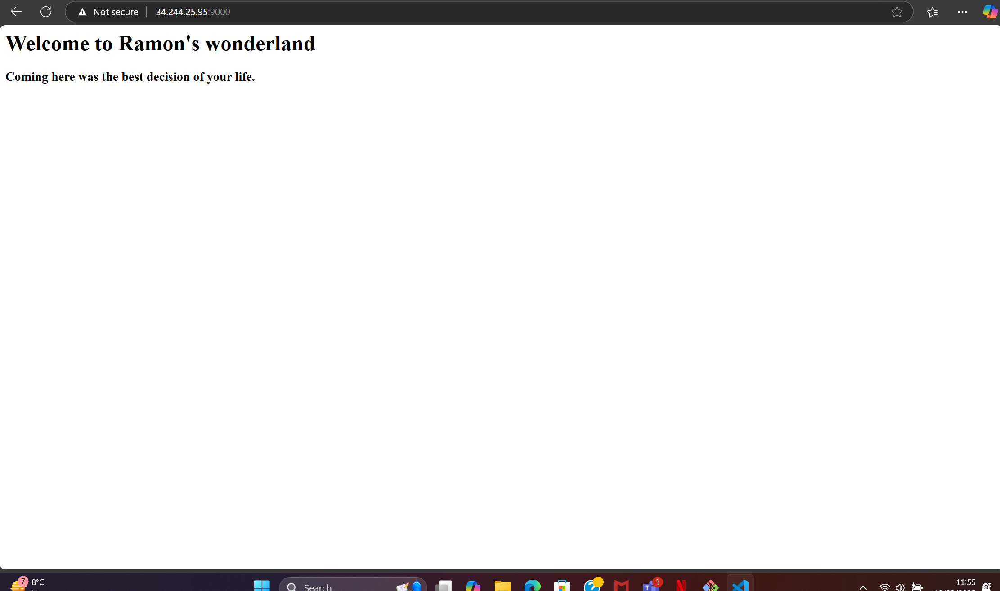

# Use Kubernetes to Create a 2-Tier Deployment

## Task: Research task
### Why is Kubernetes needed?
* Kubernetes is needed to automate the deployment, scaling, and management of containerized applications. It helps developers efficiently handle workloads, ensuring high availability, resilience, and resource optimization.

### Benefits of Kubernetes
* Scalability: Automatically scales applications based on demand.
* High Availability: Distributes workloads to ensure application uptime.
* Resource Optimization: Efficiently manages CPU and memory utilization.
* Portability: Works across on-premises, hybrid, and multi-cloud environments.
* Self-Healing: Automatically replaces failed containers.
* Rolling Updates & Rollbacks: Ensures smooth application updates without downtime.

### Sucess Stories
* Spotify: Improved scalability and developer productivity.
* Airbnb: Enhanced service availability and reliability.

### Kubernetes Architecture 
+------------------------------------------------------+
|                      Cluster                         |
+------------------------------------------------------+
| Control Plane                                        |
| - API Server      - Controller Manager               |
| - Scheduler       - etcd                             |
+------------------------------------------------------+
| Worker Nodes                                         |
| - Kubelet        - Container Runtime (Docker, etc.) |
| - Kube Proxy     - Pods                              |
+------------------------------------------------------+

### What is a cluster
* A Kubernetes cluster is a set of machines running containerized applications, consisting of a control plane and worker nodes.

### Master vs Worker Nodes
* Master Node: Manages the cluster, scheduling workloads, maintaining the desired state, and handling API requests.
* Worker Nodes: Run application workloads inside pods and communicate with the master node.

### Managed Service vs. Self-Hosted Cluster
* Managed Service (e.g., AWS EKS, GKE, AKS):
    * Pros: Easier to set up, automated scaling, integrated security features.
    * Cons: Less customization, potential vendor lock-in.

* Self-Hosted Cluster:
    * Pros: Full control over configurations, no vendor dependency.
    * Cons: Requires manual updates, security patches, and maintenance

### Control Plane vs Data Plane
* Control Plane: Manages cluster state, scheduling, and configurations.
* Data Plane: Executes workloads on worker nodes.

### Kubernetes Objects:
* Deployments: Manage application deployments and updates.

* ReplicaSets: Ensure a specified number of pod replicas are running.

* Pods: The smallest deployable unit in Kubernetes, containing one or more containers.

* ConfigMaps & Secrets: Store configuration data and sensitive information.

* Ephemeral Pods:
    * Pods are designed to be temporary and can be rescheduled or restarted anytime. This means data stored within a pod is lost if not backed by persistent storage.

### How to Mitigate Security Concerns with Containers
* Use Role-Based Access Control (RBAC).
* Enable network policies to limit traffic between pods.
* Scan container images for vulnerabilities.
* Run containers with the least privileges.
* Use Kubernetes-native security tools like PodSecurityPolicies.

### Maintained images
* Maintained images are regularly updated and patched container base images, provided by vendors or communities.
* Pros and Cons
* Pros:
* Security patches and updates reduce vulnerabilities.
* Community or vendor support ensures reliability.
* Saves time in managing base images.
* Cons:
* May contain unnecessary dependencies.
* Vendor updates may introduce breaking changes.

## Task: Get Kubernetes running using Docker Desktop
* Go into docker desktop into setting and then kubernetes 
* Enable kubernetes, will install relevant packages
* To check if its working `kubectl get service`

## Task: Create Nginx deployment only
* Create a nginx-deploy.yml file
  
* Get details of the deployment: `kubectl describe deployment <deployment-name>`
* Get details on the replicasets: `kubectl get replicasets`
* Get details on the pods: `kubectl get pods`
* Get details of all of them in one command: `kubectl get all`
* Tried to depoly it however it wasn't successful as it need to be run as a service in order for it to run

## Task: Get a NodePort service running
* Create a new yml file for the service:

* Create the service using the kubectl command `kubectl apply -f nginx-service.yml`


## Task: See what happens when we delete a pod
* Check all pods first using the command specified above 
* Delete one of the pods using this command: `kubectl delete pod <pod-name>`
* Go and check the pods again
* The pod is automatically replaced with a new one
* To get details of the new pod use this command `kubectl describe pod <pod-name>`

## Task: Increase replicas with no downtime
### Method 1: Edit the deployment file in real-time
* Step 1: `kubectl edit deployment <deployment-name>`
* Step 2: Change the replicas to 4 and save
* Step 3: Check there is now replicas by `kubectl get deployment nginx-deployment` or `kubectl get pods`

### Method 2: Apply a modified deployment file
* Step 1: Change the replicas to 5 in the yml file

* Step 2: Run the deployment file 
* Check to see there is now 5 using the command specified before


### Method 3: Use the scale command
* Step 1: Use the scale command: `kubectl get deployment nginx-deployment`
* Step 2: Check using the command earlier to confirm there is now 6.

## Task: Delete K8s deployments and services
* `kubectl delete -f nginx-deployment.yml` `kubectl delete -f nginx-service.yml` to delete the deployment and service

## Task: K8s deployment of NodeJS Sparta test app
* Copy the nginx files for deployment and service, change the name, ports, tags <br>
<br>


* Create the mongodb deployment and service file


* Make sure to create the environment variable in the sparta-app-deploy file
* I was getting the posts page up and, however there wasn't any content on their, which therefore meant it needed to be seeded. Used this command `kubectl exec -it <sparta-app-pod> -- bash` and then npm install to seed the db

## Task: Create 2-tier deployment with PV for database
* Created a pv and pvs yml file with the relevant storage allocation
* Made change to the mongo yml file as well to make sure it links to pv/pvc
* Insert test documentation in the mongo pod `kubectl exec -it mongo-559d4d89f9-k8tcx -- mongosh --eval 'db.testCollection.insertOne({_id: 1, name: "Test Document", description: "This is a test document to verify MongoDB PV/PVC persistence.", timestamp: "2025-03-05T12:00:00Z"})'`
* Verify its there `kubectl exec -it mongo-559d4d89f9-k8tcx -- mongosh --eval 'db.testCollection.find().pretty()'`
* Delete the pod, which will then get replaced with a new one automatically
* Get the name of the new pod 
* Now check to see if the documentation is still there in the new pod ` kubectl exec -it mongo-559d4d89f9-p5lsj -- mongosh --eval 'db.testCollection.find().pretty()'`
* If it is there, then it has been successful and works


## Task: Research types of autoscaling with K8s
* There are three different methods of Kubernetes autoscaling:
  * Horizontal Pod Autoscaler (HPA)
  * Vertical Pod Autoscaler (VPA)
  * Cluster Autoscaler (CA)

## Task: Use Horizontal Pod Autoscaler (HPA) to scale the app
* Step 1: Create the metric server yml file which will allow download for the pod to be created without having to worry about permissions
* Step 2: In the Sparta- app deployment yml file add resource element 
* Step 3: Create the autoscale using this command `kubectl autoscale deployment my-app --cpu-percent=50 --min=2 --max=10`
* Step 4: Install load tester 
* Step 5: Run the load tester on a loop 
* Step 6: Monior the scale behaviour: `kubectl get hpa -w  # Watch HPA status`
* 
* Use this command to delete the metric server when done `kubectl delete deployment metrics-server -n kube-system`

## Task: Setup minikube on a cloud instance running Ubuntu 22.04 LTS
* Step 1: Install minikube
  * `curl -Lo minikube https://storage.googleapis.com/minikube/releases/latest/minikube-linux-amd64 \
  && chmod +x minikube`
  * `sudo mkdir -p /usr/local/bin/
sudo install minikube /usr/local/bin/`
  * Install docker: `sudo apt install -y apt-transport-https ca-certificates curl software-properties-common`
    * `curl -fsSL https://download.docker.com/linux/ubuntu/gpg | sudo gpg --dearmor -o /usr/share/keyrings/docker-archive-keyring.gpg`
    * `echo "deb [arch=amd64 signed-by=/usr/share/keyrings/docker-archive-keyring.gpg] https://download.docker.com/linux/ubuntu $(lsb_release -cs) stable" | sudo tee /etc/apt/sources.list.d/docker.list > /dev/null`
    * `sudo apt update
      sudo apt install -y docker-ce` 
    * `sudo systemctl start docker
      sudo systemctl enable docker`
  * To give permissions an get access to docker daemon:
    * `sudo usermod -aG docker $USER`
    * `newgrp docker`
  * Run the command `minikube start --driver=docker` and it will now run minikube
  * Check to see if minikube is working `minikube status`

## Task: Deploy on three apps on one cloud instance running minikube
* Step 1: Install nginx 
* Step 2: Configure reverse proxy
  * `sudo nano /etc/nginx/sites-available/default`
   ```bash
  server {
    listen 80;

    location /app1 {
        proxy_pass http://192.168.49.2:30001/;
    }

    location /app2 {
        proxy_pass http://localhost:9000;
    }

    location /app3 {
        proxy_pass http://localhost:8080;
    }
  }
  ```
* Had issues configuring the nginx page I had to change the ip to the minikube ip and add an `/` at the end of the 30001 as the app might not be handling root (/) requests.
* Step 3: Create a yml file for app1 deployment and service


* Step 4: Execute the files
* Step 5: Go to the public ip of the vm in the browser followed up with app1. So something like this `http://3.252.77.50/app1`

* Step 6: Create a new yml file for the app2 deployment and service
<br>
<br>

* Step 7: Test to see it works by turning the minikube tunnel on and it should load the page




## Task: Use Kubernetes to deploy the Sparta test app in the cloud
* Steps are the same as the setting it up earlier
* Step 1: Install minikube
  * `curl -Lo minikube https://storage.googleapis.com/minikube/releases/latest/minikube-linux-amd64 \
  && chmod +x minikube`
  * `sudo mkdir -p /usr/local/bin/
sudo install minikube /usr/local/bin/`
  * Install docker: `sudo apt install -y apt-transport-https ca-certificates curl software-properties-common`
    * `curl -fsSL https://download.docker.com/linux/ubuntu/gpg | sudo gpg --dearmor -o /usr/share/keyrings/docker-archive-keyring.gpg`
    * `echo "deb [arch=amd64 signed-by=/usr/share/keyrings/docker-archive-keyring.gpg] https://download.docker.com/linux/ubuntu $(lsb_release -cs) stable" | sudo tee /etc/apt/sources.list.d/docker.list > /dev/null`
    * `sudo apt update
      sudo apt install -y docker-ce` 
    * `sudo systemctl start docker
      sudo systemctl enable docker`
  * To give permissions an get access to docker daemon:
    * `sudo usermod -aG docker $USER`
    * `newgrp docker`
  * Run the command `minikube start --driver=docker` and it will now run minikube
  * Check to see if minikube is working `minikube status`
* Step 2: Make sure you have all the deployment files such as the ones for sparta-app.deploy, sparta-app-service, mongo-pv.yml, mongo-pvc.yml, mongo-deploy.yml, mongo-service.yml, metric-server.yml, hpa.yml

* Go into the reverse proxy file and make sure your working with minikube ip

* Make sure you get sparta posts page working first with minikube before doing the hpa


* hpa.yml: 
```bash
apiVersion: autoscaling/v2
kind: HorizontalPodAutoscaler
metadata:
  name: sparta-hpa
spec:
  scaleTargetRef:
    apiVersion: apps/v1
    kind: Deployment
    name: sparta-app
  minReplicas: 2
  maxReplicas: 10
  metrics:
    - type: Resource
      resource:
        name: cpu
        target:
          type: Utilization
          averageUtilization: 40
  ```
  
  