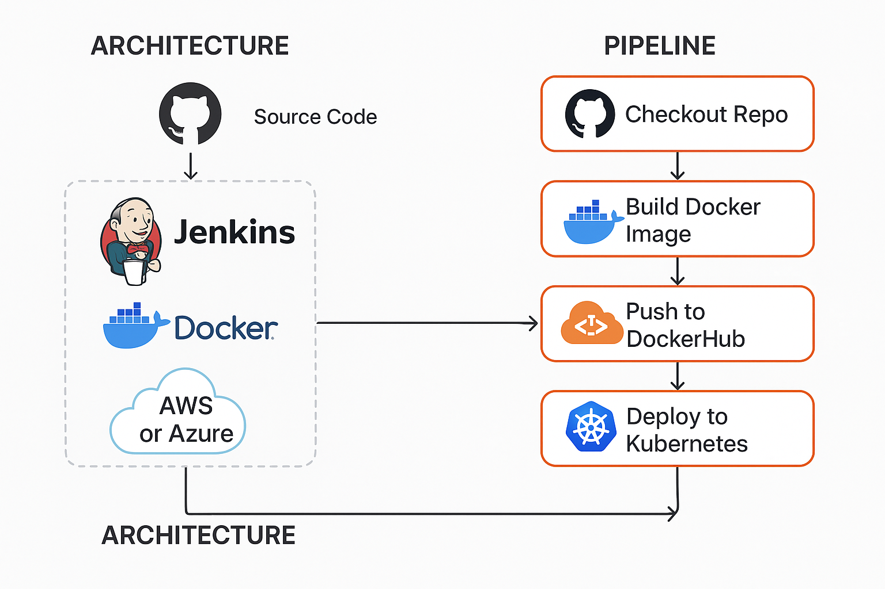
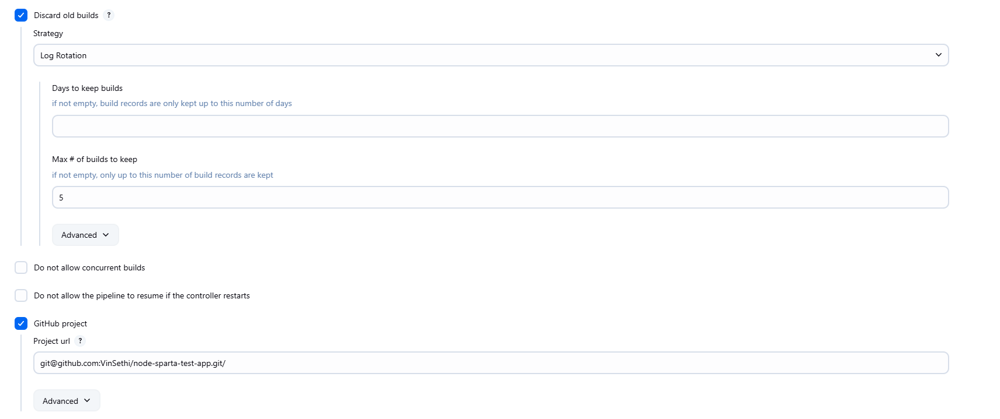
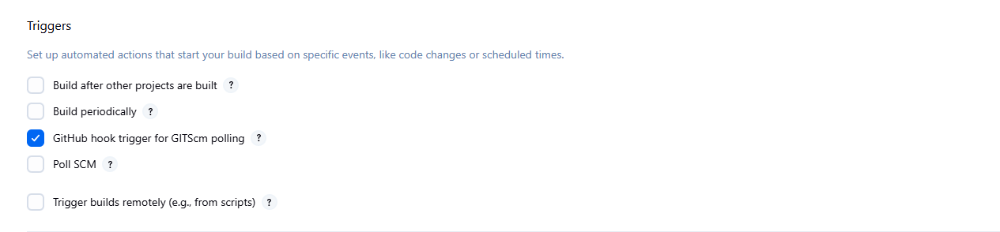
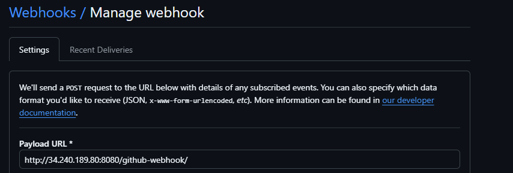
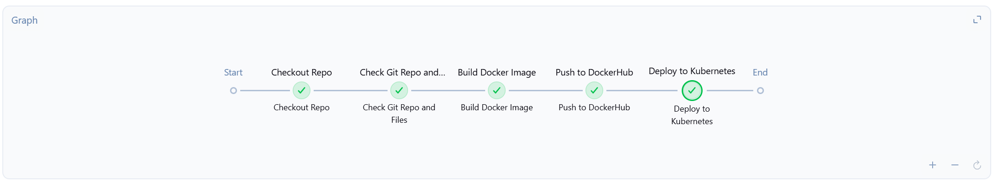

# Project 1: Docker, Kubernetes and Jenkins(CI/CD)
## Benefits of this project
* Automation & Speed
* Consistency & Reliability
* Version Control & Traceability
* Early Bug Detection

## What was learnt during the creation of this project
* The role of pipeline stages and how to script them using Jenkinsfile.
* Jenkins Pipeline Automation
* Docker Skills
* Kubernetes- Deploying the containerised app

## Blocker during the project:
There was some blockers during this project, here are some of the blockers and what was done to overcome them:
* The storage of the VM affecting the deployment and causing pods to crash when being deployed by the pipeline. The solution to this was to clear up some space by using commands such as `sudo apt clean`- cleans the cache , `sudo journalctl --vacuum-time=3d`- removes old logs
* Being able to ssh into the VM with the Kubernetes, the main reason for this was Jenkins was initally installed on this VM as well which made it difficult for it to switch users to ubuntu. The solution for this was to install Jenkins on a seperate VM, making it much simpler to make Ubuntu the user during ssh into the Kubernetes VM.

## Step 1: Create a new instance and install Jenkins on there
* Once you have created a new EC2 instance (VM), start installing the packages for Jenkins.
* Once Jenkins is installed open Jenkins using the public ip of the instance followed with port 8080

## Step 2: Github Repo
* Make sure the Github repo has the app on their, in order to make the changes and to build the docker image
* Dockerfile- Ensure the dockerfile is also in the repo, in order for the builidng docker image section of the pipeline to work.

## Step 3: Jenkins plugins
* Nodejs Plugin
* SSH agent
* Git plugin 
* Pipeline plugin

## Step 4: Create the new job and setting it up
* When creating the new job, make sure to select pipeline rather than freestyle project.
* - Make sure you select the Github project and then paste the repo ssh into it
*  - Select 'Github hook trigger' to allow for when a change is made this will allow for the webhook trigger to take place
* - Go to Github, on the repo settings and click on webhooks and add a new one. Input server address of Jenkins.

## Step 5: Setting up credentials in Jenkins for security and access
There are 3 types of credentials that need to be setup in the credentials are for the pipeline: 
1. Input the private key for the Github repo, (Go to Github, in the repo settings and into deploy keys and input public key with read/write access)
2. DockerHub- Username and password for Dockerhub, to allow to login and push to docker hub
3. Target VM- To be able to SSH into the target VM( Where the docker image is going to be deployed with kubernetes)

## Step 6: Creating the pipeline script
1. First step is to set up the environmental variables such as the dockerhub, target vm and github credentials
2. Next step is to set up the variable and call the variable of the github credentials 
3. Next it will check the directory and confirm you are in the correct directory, it will also provide a list of all the files in the repo
4. Next step is to build the docker image which has the new change on it- this will be done by using the docker file that is in the repo
5. After this it will push the new image to docker hub, using the environmental variable that was set up using docker credentials such as username and password
6. The last step is to deploy it to kubernetes- Using the SSH credentials for the target VM (Kubernetes VM) specifying the user 'ubuntu', exporting the kuberentes config file- the path to get there. Deploy it using the kubectl command, and go have a look at your pods to see.

## Working CI/CD Pipeline

